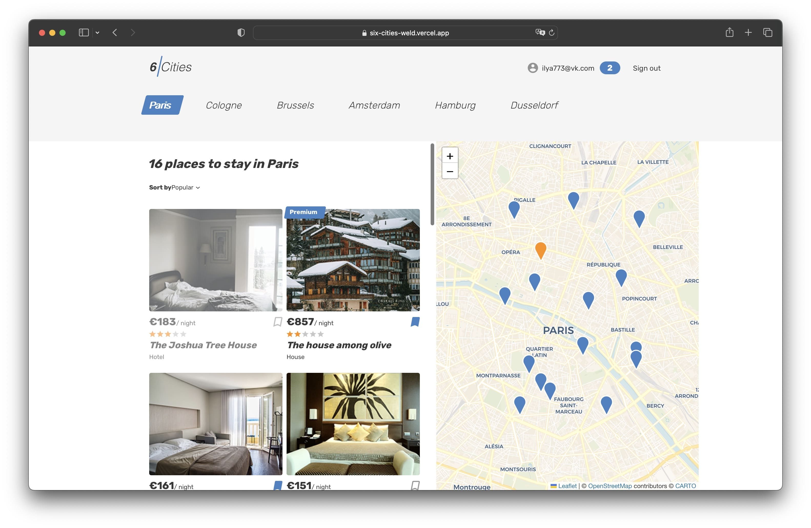
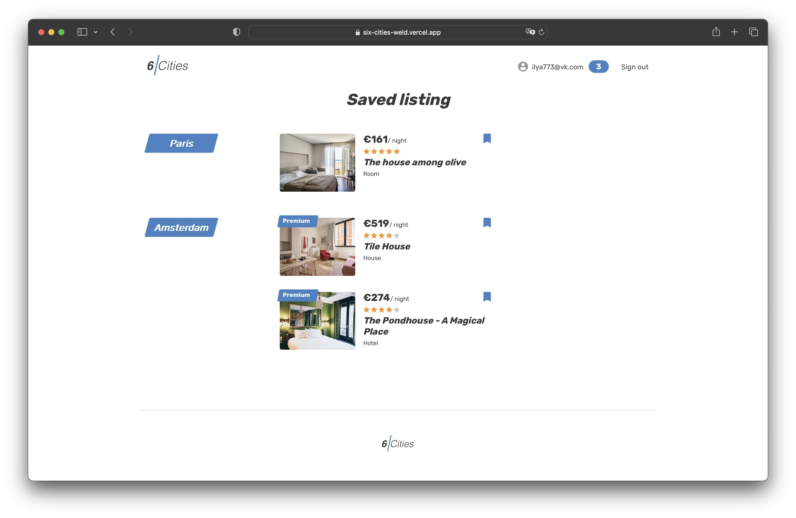
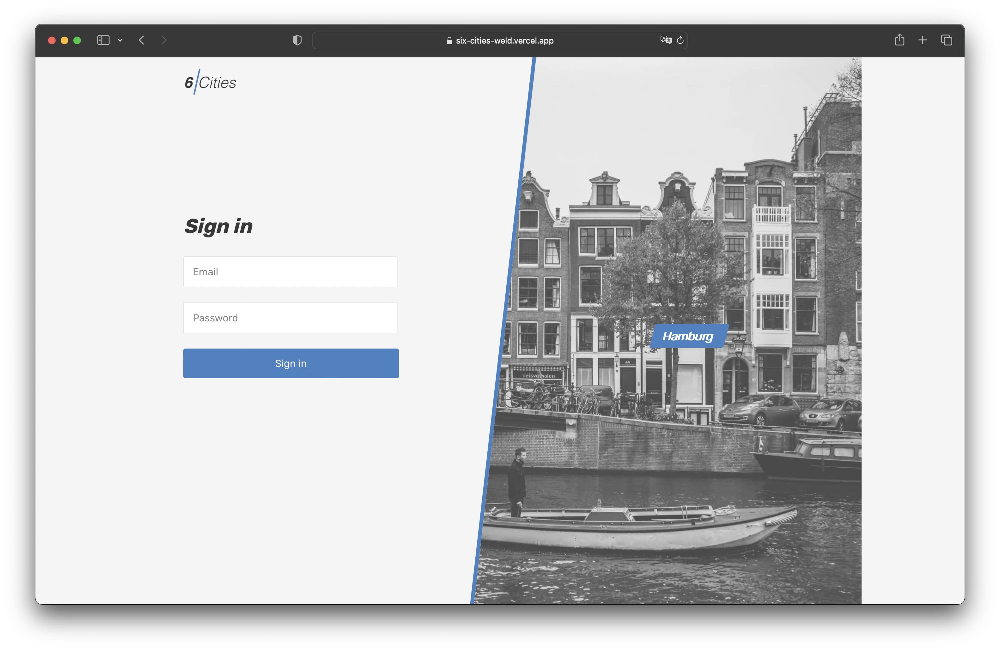
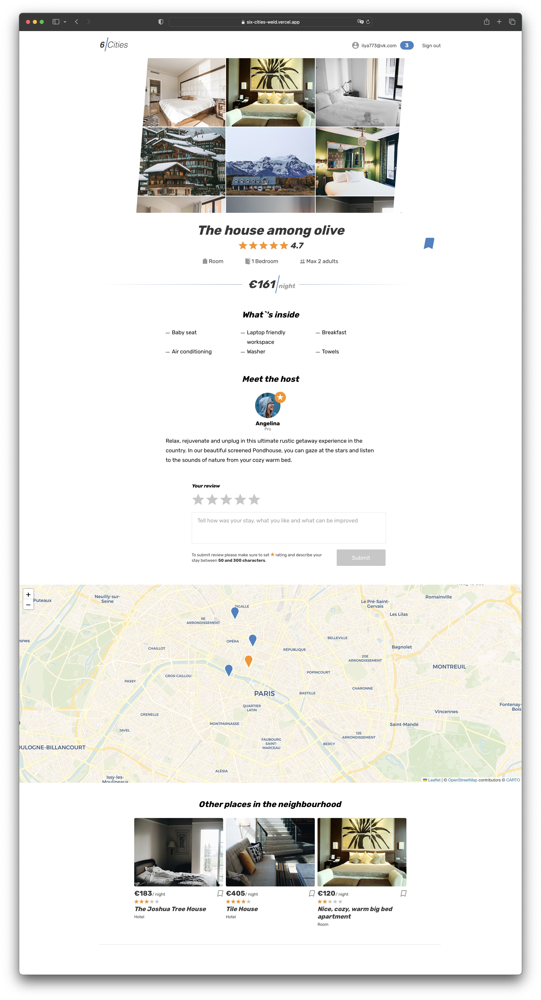

# Six Cities

«Six Cities» — is a service for travelers who do not want to overpay for rental housing. Choose one of the six popular cities to travel to and get an up-to-date list of rental offers. Detailed information about housing, the display of the object on the map, as well as the laconic interface of the service will help you quickly choose the best offer.

### Technology stack:
- React
- TypeScript
- Redux
- Axios
- Redux Thunk
- Jest
- React Router

### Demo:
https://six-cities-weld.vercel.app/

## Index:

## Favorites:

## Login:

## Offer:

